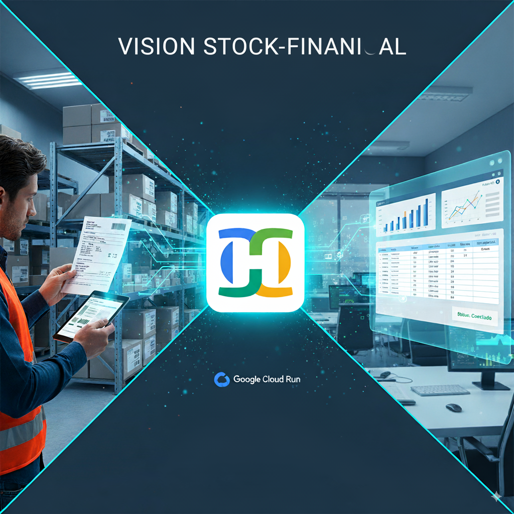

# 📊 Visão Estoque-Financeiro_Applet

## 📝 Descrição
O **Visão Estoque-Financeiro_Applet**, desenvolvido no **Google AI Studio** e implantado via **Cloud Run**, tem como missão **otimizar a comunicação e a integração de dados** entre os departamentos de **Estoque** e **Financeiro**.  

Aproveitando o poder do **Gemini Flash 2.5 Pro** para compreensão de imagens, o applet transforma o processo de registro e validação de informações, **minimizando erros** e **acelerando a tomada de decisões**.

---

## ❌ Problema Resolvido
A comunicação manual entre estoque e finanças gera impactos negativos como:
- **Erros de entrada:** digitação incorreta de códigos, quantidades ou valores.
- **Atrasos:** conciliações lentas de faturas com recebimentos.
- **Discrepâncias:** divergências difíceis de rastrear entre inventário físico e contábil.
- **Falta de evidências visuais:** ausência de registros confiáveis para auditoria.

---

## 🔑 Principais Características
- **Entrada de dados simplificada:** captura de fotos de documentos de inventário (faturas, etiquetas, relatórios).
- **Compreensão multimodal (Gemini Flash 2.5 Pro):**
  - OCR para extração de texto (números de faturas, fornecedores, valores).
  - Leitura de código (QR e barras) para identificação de produtos.
  - Reconhecimento de elementos visuais (ex: embalagens / tipos de itens).
- **Resumo estruturado:** dados visuais convertidos em relatórios claros e padronizados.
- **Integração flexível:** saída pode ser enviada por APIs para ERPs, e-mails ou sistemas de chat internos.
- **Histórico e auditoria:** registro visual e textual para conciliações futuras.

---

## ⚙️ Como Funciona
1. **Captura de imagem:** funcionário tira uma foto da fatura, etiqueta ou relatório.
2. **Processamento Gemini:** imagem enviada ao **Gemini Flash 2.5 Pro**.
3. **Extração de informações:** fatura, fornecedor, códigos, itens, valores.
4. **Geração de resumo:** padronização dos dados extraídos em um formato legível.
5. **Comunicação:** resumo apresentado ao usuário → enviado ao setor financeiro.

---

## 🎯 Benefícios
- ✅ **Redução de erros** (menos digitação manual)
- ⚡ **Agilidade operacional** (conciliação mais rápida)
- 🔍 **Transparência e evidências** (registros auditáveis)
- 🕒 **Otimização de tempo** (menos burocracia)
- 🤝 **Colaboração aprimorada** (integração clara entre setores)

---

## 🛠️ Tecnologias Utilizadas
- **Google AI Studio** → prototipagem e teste do modelo Gemini
- **Gemini Flash 2.5 Pro API** → OCR e visão multimodal em tempo real
- **Google Cloud Run** → implantação escalável e sem servidor
- **Frontend (conceitual)** → interface leve em **HTML/CSS/JavaScript**

---

## 📜 Licença
Projeto sob licença **MIT**.  
Sinta-se livre para usar, modificar e contribuir. 🤝

---

👨‍💻 Desenvolvido com foco em **integração inteligente** entre **Estoque** e **Financeiro**.
